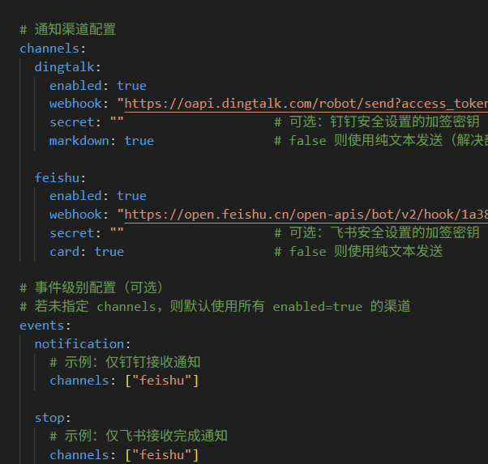

# cc-hooks-notify

轻量级 Claude Code 通知插件，支持钉钉和飞书。任务完成、停止或需要权限时自动推送消息。

## 特性

- **Plugin 模式**：支持 Claude Code Plugin 标准，一条命令安装
- **可视化配置**：通过插件设置界面直接配置 webhook，无需编辑配置文件
- **多事件支持**：支持 Stop、Notification、TaskCompleted 等事件
- **配置简单**：直接配置使用，没有过多复杂的功能

## 安装

### 方式一：从 GitHub 安装（推荐）

```bash
# 1. 添加 marketplace
/plugin marketplace add ipfred/cc-hooks-notify

# 2. 安装插件
/plugin install cc-hooks-notify@cc-hooks-notify --scope user

# 3. 重新加载
/reload-plugins
```

### 通过插件界面配置（推荐）

安装后运行 `/plugin`，找到 `cc-hooks-notify`，点击 ⚙️ 设置图标：

| 配置项 | 说明 |
|--------|------|
| 启用钉钉通知 | 是否启用钉钉消息推送 |
| 钉钉 Webhook URL | 钉钉机器人的 Webhook 地址 |
| 钉钉签名密钥 | 钉钉机器人的加签密钥（可选） |
| 启用飞书通知 | 是否启用飞书消息推送 |
| 飞书 Webhook URL | 飞书机器人的 Webhook 地址 |
| 飞书签名密钥 | 飞书机器人的加签密钥（可选） |

### 获取 Webhook 地址

**钉钉**：
1. 打开钉钉群 → 群设置 → 智能群助手 → 添加机器人
2. 选择「自定义」机器人
3. 安全设置选择「加签」，复制密钥/ 或设置为关键词 `Claude`
4. 复制 Webhook 地址

**飞书**：
1. 打开飞书群 → 设置 → 群机器人 → 添加机器人
2. 选择「自定义机器人」
3. 复制 Webhook 地址

### 方式二：本地配置安装

直接在 `.claude/settings.json` 中配置hooks，原理就是触发执行py脚本，最原始的方式感觉最简单

1. clone项目 编辑配置
```bash
# 1. 克隆仓库
git clone https://github.com/ipfred/cc-hooks-notify.git
cd cc-hooks-notify
# 手动编辑配置文件
cp config.yaml.example config.yaml
```

2. 配置 `.claude/settings.json`

> 因为windows系统 claude 使用的 gitbash 路径写成样例中的那样

```json
"hooks": {
  "TaskCompleted": [
    {
      "hooks": [
        {
          "type": "command",
          "timeout": 10,
          "async": true,
          "command": "python /e/my_work/github_pro/cc-hooks-notify/cc_hooks_notify/main.py"
        }
      ]
    }
  ],
  "Stop": [
    {
      "hooks": [
        {
          "type": "command",
          "timeout": 10,
          "async": true,
          "command": "python /e/my_work/github_pro/cc-hooks-notify/cc_hooks_notify/main.py"
        }
      ]
    }
  ],
  "Notification": [
    {
      "matcher": "permission_prompt|idle_prompt",
      "hooks": [
        {
          "type": "command",
          "timeout": 10,
          "async": true,
          "command": "python /e/my_work/github_pro/cc-hooks-notify/cc_hooks_notify/main.py"
        }
      ]
    }
  ]
}
```

### 方式三：Codex Hooks 配置（实验功能）

1. 启用 Codex hooks 特性开关（`~/.codex/config.toml`）：

```toml
[features]
codex_hooks = true
```

1. 在仓库根目录创建 `.codex/hooks.json`：

```json
{
  "hooks": {
    "Stop": [
      {
        "hooks": [
          {
            "type": "command",
            "command": "python3 \"$(git rev-parse --show-toplevel)/main.py\"",
            "timeout": 10,
            "statusMessage": "cc-hooks-notify sending"
          }
        ]
      }
    ]
  }
}
```

3. 保持 `config.yaml`（或插件配置）中的钉钉/飞书 webhook 已正确填写。

说明：
- Codex 会同时加载 `~/.codex/hooks.json` 和 `<repo>/.codex/hooks.json`，命中的 hooks 会合并执行。
- 对本项目来说，建议先使用 `Stop` 事件（Codex 当前没有与 Claude `Notification`、`TaskCompleted` 完全一致的事件名）。
- 根据 Codex 官方文档（2026-04-07），hooks 仍是实验功能，且 Windows 支持暂时关闭。
- 官方文档：https://developers.openai.com/codex/hooks

## 通知事件

| 事件 | 触发时机 |
|------|----------|
| Stop | Claude 完成响应时 |
| Notification | 需要用户确认权限、空闲提示时 |
| TaskCompleted | 任务完成时 |

## 目录结构

```
cc-hooks-notify/
├── .claude-plugin/
│   ├── plugin.json        # Plugin 元数据和配置项
│   └── marketplace.json   # Marketplace 配置
├── hooks/
│   ├── hooks.json         # Hook 事件配置
│   └── scripts/
│       └── notify.sh      # 入口脚本
├── channels/              # 通知渠道
│   ├── base.py            # 抽象基类
│   ├── dingtalk.py        # 钉钉
│   ├── feishu.py          # 飞书
│   └── __init__.py        # 渠道注册
├── main.py                # 统一入口
├── notifier.py            # 核心通知逻辑
├── parser.py              # Claude Code JSON 解析
├── config.py              # 配置加载
└── config.yaml.example    # 配置模板（可选）
```

## 故障排查

查看日志：

```bash
# 日志文件位置
cat logs/cc_hooks_notify.log

# 或查看最新日志
tail -f logs/cc_hooks_notify.log
```

常见问题：

1. **没有收到通知**
   - 检查 `/plugin` 中配置是否正确
   - 确认 webhook URL 是否有效
   - 查看日志是否有错误

2. **插件加载失败**
   - 确保已安装 `python3` 环境和安装 `pyyaml`包
   - 运行 `/reload-plugins` 重新加载

---
## License

MIT
